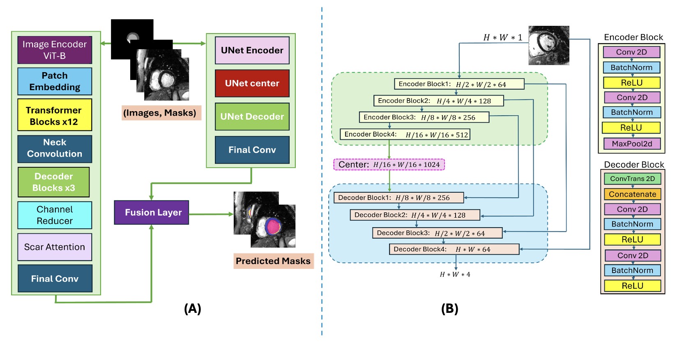

# ScarNet: A Novel Foundation Model for Automated Myocardial Scar Quantification from LGE in Cardiac MRI

## Overview
ScarNet is a deep learning model specifically designed for automated myocardial scar segmentation and quantification in Late Gadolinium Enhancement (LGE) Cardiac MRI. By leveraging a hybrid architecture that integrates MedSAM's Vision Transformer (ViT)-based encoder with a U-Net decoder, ScarNet achieves state-of-the-art performance in scar segmentation and quantification.

## Features
1. **Hybrid Architecture**:
   - Combines the global context awareness of transformers with the precise localization capabilities of CNNs.
   - MedSAM's ViT-based encoder for global feature extraction
   - U-Net decoder for precise localization
   - Incorporates specialized attention mechanisms, including SE layers and ScarAttention blocks.

2. **Innovative Loss Function**:
   - Combines Dice, Focal, and Cross-Entropy losses to address class imbalance and improve segmentation accuracy.

3. **Robust Performance**:
   - Demonstrates high Dice scores (median = 0.912) for scar segmentation, outperforming existing models.
   - Robust against noise perturbations, ensuring reliability in varying imaging conditions.

4. **Efficient Training Pipeline**:
1. Image preprocessing and augmentation
2. Parallel processing:
   - MedSAM pathway
   - U-Net pathway
3. Adaptive feature fusion
4. Output generation

5. **Efficient Inference Pipeline**:
   - Designed for seamless integration into clinical workflows.

## Key Results
- ScarNet achieves a median scar Dice score of 0.912, compared to 0.046 for MedSAM and 0.638 for nnU-Net.
- Demonstrates exceptional robustness across different image qualities and noise conditions.

## Figures
### Model Architecture
**Figure 1:** Hybrid architecture combining MedSAM's ViT-based with U-Net's multi-scale decoder. This figure highlights ScarNet's integration of attention mechanisms for precise scar segmentation.



**Figure 2:** Detailed encoder-decoder overview, showcasing attention blocks and SE layers that enhance feature extraction and refine scar segmentation.


### Comparative Analysis
**Figure 3:** Comparative visualization of ScarNet, MedSAM, and nnU-Net segmentations. ScarNet demonstrates superior segmentation accuracy across different cardiac regions.


**Figure 4:** Performance analysis across varying training data sizes. ScarNet consistently outperforms MedSAM and nnU-Net in both myocardium and scar segmentation.


**Figure 5:** Representative test cases demonstrating ScarNet's segmentation performance compared to MedSAM and nnU-Net.


**Figure 6:** Performance metrics for scar volume quantification, including Bland-Altman plots and correlation analyses. ScarNet achieves near-perfect correlation with manual segmentation.


## Methodology
### Dataset
- Retrospective analysis using de-identified LGE images from 736 patients with ischemic cardiomyopathy.
- Training set: 552 patients; Testing set: 184 patients.

### Training Pipeline
1. Image preprocessing and augmentation.
2. Parallel processing through MedSAM and U-Net pathways.
3. Adaptive feature fusion and output generation.

### Loss Function
The multi-component loss function is defined as:
\[ \mathcal{L}_{ScarNet} = \lambda_1 \text{FTL} + \lambda_2 \text{DL} + \lambda_3 \text{CE} \]
- FTL: Focal Tversky Loss
- DL: Dice Loss
- CE: Cross-Entropy Loss

## Installation and Usage

### Prerequisites
- Python 3.8+
- PyTorch 1.9+
- CUDA-capable GPU

### Setup
1. Clone the repository:
```bash
git clone https://github.com/NedaTavakoli/ScarNet.git
cd ScarNet
```

2. Install dependencies:
```bash
pip install -r requirements.txt
```

3. Run training:
```bash
python train.py

# With custom config
python train.py --config path/to/config.yaml
```

### Data Preparation
Organize your data in the following structure:
```
data/
├── training/
│   ├── images/
│   └── masks/
└── testing/
    ├── images/
    └── masks/
```

### Training Configuration
Modify `config.py` to adjust:
- Learning rate
- Batch size
- Training epochs
- Model architecture parameters
- Augmentation settings

## License
MIT License - See LICENSE file for details

## Contact
Neda Tavakoli  
Email: neda.tavakoli@northwestern.edu

## Citation
```bibtex
@article{ScarNet2024,
    title={ScarNet: A Novel Foundation Model for Automated Myocardial Scar Quantification from LGE},
    author={Tavakoli, Neda and others},
    year={2024}
}
```